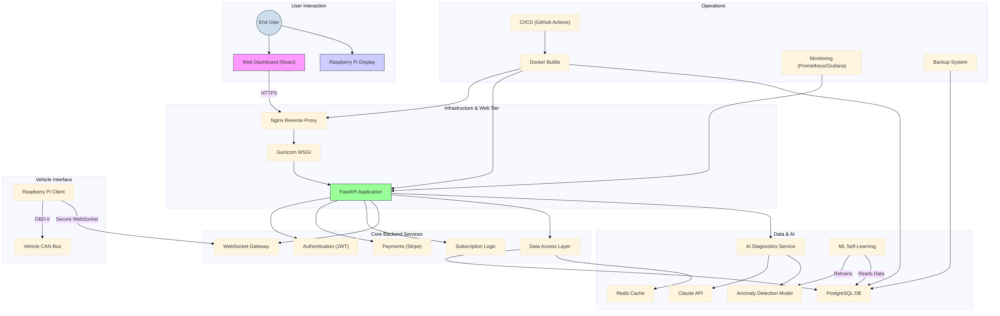

# Mercedes W222 OBD Scanner - Deployment Guide

**Author:** Manus AI
**Version:** 3.0.0
**Last Updated:** 2025-09-27

## 1. Introduction

This guide provides comprehensive instructions for deploying the **Mercedes W222 OBD Scanner** application in a production environment. It covers server setup, application deployment, and configuration for both personal and commercial use.

## 2. System Architecture

The application consists of several key components:

- **Web Application:** FastAPI-based backend with a React frontend.
- **Database:** SQLite for data storage.
- **Raspberry Pi Client:** Python-based client for OBD-II communication.
- **Monitoring:** Prometheus and Grafana for system monitoring.
- **Security:** WAF, MFA, and audit logging.



## 3. Server Requirements

### 3.1. Minimum Requirements

- **OS:** Ubuntu 22.04 LTS
- **CPU:** 2 cores
- **RAM:** 4 GB
- **Storage:** 50 GB SSD
- **Network:** Public IP address with open ports 80 and 443.

### 3.2. Recommended Requirements

- **OS:** Ubuntu 22.04 LTS
- **CPU:** 4 cores
- **RAM:** 8 GB
- **Storage:** 100 GB SSD
- **Network:** Public IP address with open ports 80 and 443.

## 4. Server Setup

### 4.1. Install Dependencies

```bash
sudo apt-get update
sudo apt-get install -y python3-pip python3-venv git docker.io docker-compose
```

### 4.2. Clone the Repository

```bash
git clone https://github.com/pavelraiden/mercedes-w222-obd-scanner.git
cd mercedes-w222-obd-scanner
```

### 4.3. Configure Environment Variables

Create a `.env` file in the root directory of the project and add the following variables:

```
# Application settings
SECRET_KEY=your_super_secret_key
DEBUG=False

# Database settings
DATABASE_URL=sqlite:///./database.db

# Stripe settings
STRIPE_SECRET_KEY=your_stripe_secret_key
STRIPE_WEBHOOK_SECRET=your_stripe_webhook_secret

# JWT settings
JWT_SECRET=your_jwt_secret
JWT_ALGORITHM=HS256

# Email settings (for MFA and alerts)
MAIL_SERVER=smtp.example.com
MAIL_PORT=587
MAIL_USERNAME=your_email@example.com
MAIL_PASSWORD=your_email_password
MAIL_USE_TLS=True
```

## 5. Application Deployment

### 5.1. Build and Run with Docker Compose

The recommended way to deploy the application is using Docker Compose. This will build and run all the necessary services.

```bash
sudo docker-compose -f docker-compose.production.yml up --build -d
```

This will start the following services:

- `web`: The FastAPI web application.
- `nginx`: Nginx reverse proxy.
- `prometheus`: Prometheus monitoring server.
- `grafana`: Grafana dashboard.

### 5.2. Manual Deployment (for development)

For development purposes, you can run the application manually:

```bash
# Create and activate virtual environment
python3 -m venv venv
source venv/bin/activate

# Install dependencies
pip install -r requirements.txt

# Run the application
uvicorn web_app.main:app --host 0.0.0.0 --port 8000
```

## 6. Raspberry Pi Client Setup

Refer to the `docs/RASPBERRY_PI_SETUP.md` guide for detailed instructions on setting up the Raspberry Pi client.

## 7. Post-Deployment Configuration

### 7.1. Configure Nginx

Nginx is configured to act as a reverse proxy for the web application. You may need to update the `docker/nginx.conf` file with your domain name and SSL certificate paths.

### 7.2. Configure Grafana

Grafana is available at `http://your_domain:3000`. The default credentials are `admin:admin`. You will be prompted to change the password on first login.

### 7.3. Configure Prometheus

Prometheus is available at `http://your_domain:9090`. It is pre-configured to scrape metrics from the web application.

## 8. Maintenance and Updates

### 8.1. Updating the Application

To update the application, pull the latest changes from the Git repository and rebuild the Docker containers:

```bash
git pull origin main
sudo docker-compose -f docker-compose.production.yml up --build -d
```

### 8.2. Backups and Restore

Refer to the `disaster_recovery/backup_system.py` for automated backup and restore procedures.

## 9. Troubleshooting

- **502 Bad Gateway:** This usually indicates that the web application is not running or is not accessible by Nginx. Check the logs of the `web` container.
- **Database connection errors:** Ensure that the `DATABASE_URL` environment variable is set correctly.
- **Permission errors:** Make sure that the user running the application has the necessary permissions to access files and directories.

For more detailed troubleshooting, refer to the logs of the respective services.

