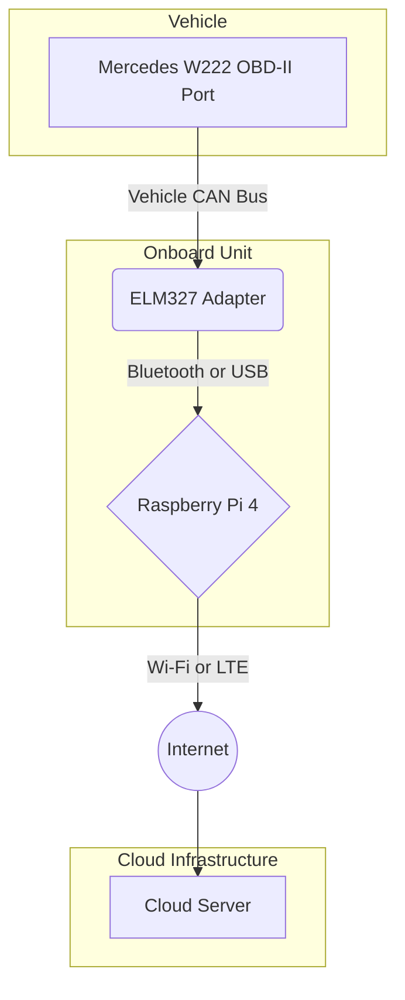

# Mercedes W222 OBD Scanner: Raspberry Pi Setup Guide

**Author:** Manus AI & Claude AI
**Date:** September 26, 2025
**Version:** 3.1.0

---

## 1. Introduction

This guide provides step-by-step instructions for setting up a Raspberry Pi to work with the Mercedes W222 OBD Scanner system. This setup will allow you to connect directly to your vehicle's OBD-II port, collect real-time data, and securely transmit it to the cloud for analysis.

### 1.1. Hardware Requirements

| Component | Description | Recommended Model | Notes |
| :--- | :--- | :--- | :--- |
| **Raspberry Pi** | Single-board computer | Raspberry Pi 4 Model B (4GB+) | Pi 3B+ is also supported, but 4 is recommended for performance. |
| **MicroSD Card** | Storage for the OS and software | 32GB+ Class 10 A1/A2 | High-endurance card recommended for reliability. |
| **Power Supply** | USB-C power adapter | Official Raspberry Pi 5.1V 3A | A stable power supply is critical. |
| **OBD-II Adapter** | Connects to the vehicle's port | ELM327-compatible (Bluetooth/USB) | A high-quality adapter is crucial for reliable data. |
| **Case** (Optional) | Protective enclosure for the Pi | Argon ONE or FLIRC Case | A case with cooling (fan or passive) is recommended. |
| **LTE/4G Modem** (Optional)| For cellular connectivity | Waveshare SIM7600G-H 4G HAT | For setups without consistent Wi-Fi access. |

### 1.2. Software Requirements

- **Raspberry Pi OS:** The official operating system for the Raspberry Pi (32-bit or 64-bit).
- **Python 3.9+:** Pre-installed on recent versions of Raspberry Pi OS.
- **Git:** For cloning the repository.

## 2. Step-by-Step Setup

### 2.1. Prepare the MicroSD Card

1.  **Download Raspberry Pi Imager:** Get the official imager from the [Raspberry Pi website](https://www.raspberrypi.com/software/).
2.  **Choose OS:** Open the imager, click "Choose OS," and select "Raspberry Pi OS (other)." Choose the "Lite" version for a headless setup (no desktop).
3.  **Choose Storage:** Select your microSD card.
4.  **Advanced Options:** Click the gear icon to pre-configure:
    - **Set hostname:** `mercedes-scanner`
    - **Enable SSH:** Check the box and set a secure password.
    - **Configure Wi-Fi:** Enter your Wi-Fi network's SSID and password.
    - **Set locale settings:** Set your timezone and keyboard layout.
5.  **Write:** Click the "Write" button and wait for the process to complete.

### 2.2. First Boot and Configuration

1.  **Insert Card and Power On:** Insert the microSD card into your Raspberry Pi and connect the power supply.
2.  **Find IP Address:** Wait a few minutes for the Pi to boot. Find its IP address from your router's admin page or using a network scanner like `nmap` (`nmap -sn 192.168.1.0/24`).
3.  **Connect via SSH:** Open a terminal and connect to the Pi:
    ```bash
    ssh pi@<YOUR_PI_IP_ADDRESS>
    ```
    Enter the password you set in the imager.

4.  **Update System:** It's crucial to start with an up-to-date system.
    ```bash
    sudo apt update && sudo apt upgrade -y
    ```

### 2.3. Install the OBD Scanner Software

1.  **Install Dependencies:** Install Python libraries and tools needed for the client.
    ```bash
    sudo apt install -y python3-pip git python3-venv
    ```

2.  **Clone the Repository:** Clone the official project repository from GitHub.
    ```bash
    git clone https://github.com/pavelraiden/mercedes-w222-obd-scanner.git
    cd mercedes-w222-obd-scanner
    ```

3.  **Run the Automated Setup Script:** We've created a script to handle the installation and configuration of the client software.
    ```bash
    chmod +x raspberry_pi_client/setup.sh
    ./raspberry_pi_client/setup.sh
    ```
    This script will:
    - Create a Python virtual environment.
    - Install all required Python packages.
    - Set up a systemd service to run the client automatically on boot.
    - Prompt you for your user credentials and device ID.

### 2.4. Configure the OBD Adapter

**For Bluetooth Adapters:**

1.  **Pair the Device:**
    ```bash
    sudo bluetoothctl
    [bluetooth]# power on
    [bluetooth]# agent on
    [bluetooth]# default-agent
    [bluetooth]# scan on
    ```
    Wait for your OBD adapter to appear (e.g., `OBDII`). Note its MAC address.
    ```bash
    [bluetooth]# pair <YOUR_DEVICE_MAC_ADDRESS>
    [bluetooth]# trust <YOUR_DEVICE_MAC_ADDRESS>
    [bluetooth]# exit
    ```

2.  **Bind the Serial Port:** Create a persistent serial port for the device.
    ```bash
    sudo rfcomm bind 0 <YOUR_DEVICE_MAC_ADDRESS> 1
    ```
    The device will now be available at `/dev/rfcomm0`.

**For USB Adapters:**

- Most USB ELM327 adapters will be automatically detected and available at a path like `/dev/ttyUSB0`. No special configuration is usually needed.

## 3. Hardware Connection Diagram

This diagram illustrates how the components connect.



## 4. Troubleshooting

- **Cannot connect to Wi-Fi:** Double-check the SSID and password in `/etc/wpa_supplicant/wpa_supplicant.conf`.
- **SSH connection refused:** Ensure SSH is enabled (check for a file named `ssh` in the boot partition of the SD card). Verify the IP address.
- **OBD client service not running:** Check the service status with `sudo systemctl status obd-client.service`. View logs with `journalctl -u obd-client.service`.
- **No data from OBD adapter:** Verify the adapter is powered on and correctly paired/connected. Check that the correct port is configured in the client settings.

---

This guide provides a solid foundation for setting up your Raspberry Pi. For more advanced configurations, refer to the official Raspberry Pi documentation. 
