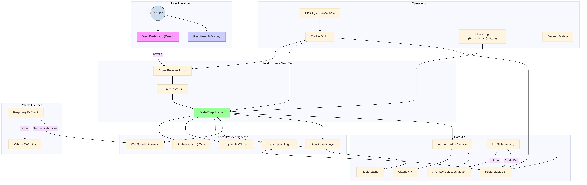

# Mercedes W222 OBD Scanner - Technical Documentation

**Author:** Manus AI & Claude
**Version:** 3.0.0-production
**Date:** 2025-09-27

## 1. Introduction

This document provides a comprehensive technical overview of the **Mercedes W222 OBD Scanner**, a professional-grade diagnostic and analysis tool designed for both personal and commercial use. The system offers advanced features including AI-powered diagnostics, real-time monitoring, a self-learning machine learning system, and a user-friendly web interface.

### 1.1. Purpose

The purpose of this document is to detail the system architecture, core components, security measures, and operational procedures. It is intended for developers, system administrators, and technical support staff who need a deep understanding of the system's inner workings.

### 1.2. Scope

This documentation covers the following key aspects:
- **System Architecture:** High-level design and component interactions.
- **Core Components:** Detailed breakdown of backend, frontend, and client applications.
- **Security Hardening:** Comprehensive overview of security measures.
- **AI & Machine Learning:** Explanation of the AI-powered diagnostic and self-learning systems.
- **Deployment & Operations:** CI/CD pipeline, monitoring, and backup procedures.

## 2. System Architecture

The system is built on a modern, scalable microservices-oriented architecture designed for high performance, reliability, and security. It consists of a backend API, a web-based frontend, a Raspberry Pi client for OBD data collection, and a comprehensive monitoring and deployment infrastructure.

### 2.1. Architectural Diagram

### 2.2. Core Technologies

The system leverages a robust stack of modern technologies to deliver a production-ready experience:

| Component              | Technology                | Description                                                       |
| ---------------------- | ------------------------- | ----------------------------------------------------------------- |
| **Backend**            | FastAPI (Python)          | High-performance asynchronous web framework for the main API.     |
| **Frontend**           | React (JavaScript)        | Modern JavaScript library for building the user interface.        |
| **Database**           | PostgreSQL                | Production-grade relational database for data storage.            |
| **Cache**              | Redis                     | In-memory data store for caching and session management.          |
| **OBD Client**         | Python (on Raspberry Pi)  | Client application for collecting and transmitting vehicle data.  |
| **Deployment**         | Docker, Docker Compose    | Containerization for consistent and scalable deployments.         |
| **Web Server**         | Nginx, Gunicorn           | Production-ready web server and WSGI server.                      |
| **Monitoring**         | Prometheus, Grafana       | Comprehensive monitoring and visualization stack.                 |
| **CI/CD**              | GitHub Actions            | Automated pipeline for continuous integration and deployment.     |
| **AI & ML**            | Anthropic Claude, Scikit-learn | AI-powered analysis and local machine learning for anomaly detection. |

## 3. Core Components

### 3.1. Backend API (FastAPI)

The backend is a secure, high-performance FastAPI application that serves as the central nervous system of the project. It provides:

- **Authentication & Authorization:** Secure user registration, login, and session management using JWT tokens.
- **User & Device Management:** Endpoints for managing user profiles, subscriptions, and registered devices.
- **Payment Integration:** Full integration with Stripe for subscription management and payments.
- **Data Processing:** Real-time processing of OBD data received from Raspberry Pi clients via a secure WebSocket gateway.
- **AI & ML Integration:** Orchestrates calls to the Claude API for trip analysis and manages the local machine learning model for anomaly detection.

### 3.2. Frontend (React)

The frontend is a modern, responsive web application built with React and the shadcn/ui component library. It provides a user-friendly interface for:

- **Real-time Dashboard:** Visualization of real-time vehicle data, including engine RPM, speed, and coolant temperature.
- **Trip History:** Analysis of past trips with AI-powered insights and recommendations.
- **Predictive Maintenance:** Display of predictive maintenance alerts and component wear indices.
- **User Account Management:** Interface for managing user profiles, subscriptions, and payment methods.

### 3.3. Raspberry Pi Client & Tamagotchi Display

The Raspberry Pi client is a Python application responsible for collecting data from the vehicle's OBD-II port. Its key features include:

- **OBD-II & UDS Protocol Support:** Flexible architecture for communicating with various vehicle protocols.
- **Real-time Data Streaming:** Secure WebSocket connection for real-time data transmission to the backend.
- **Tamagotchi Interface:** An interactive display that provides a 

gamified view of the vehicle's health, encouraging proactive maintenance.
- **Offline Caching:** Local caching of data in case of network interruptions, with automatic synchronization upon reconnection.

## 4. Security Hardening

Security is a top priority, and a multi-layered approach has been implemented to protect against common vulnerabilities and ensure data integrity.

### 4.1. Authentication & Authorization

- **JWT (JSON Web Tokens):** All authenticated endpoints are protected using JWTs with short expiration times and refresh token rotation.
- **Secure Password Hashing:** User passwords are hashed using PBKDF2 with a unique salt for each user, making them resilient to brute-force attacks.
- **Role-Based Access Control (RBAC):** The system supports different user roles (e.g., user, admin) with granular permissions.

### 4.2. API & Application Security

- **Input Validation:** All user inputs are strictly validated using Pydantic models to prevent injection attacks.
- **SQL Injection Prevention:** The data access layer uses parameterized queries to prevent SQL injection vulnerabilities.
- **Path Traversal Protection:** The backup and restore system includes validation to prevent path traversal attacks when handling archives.
- **Security Headers:** The API responds with a comprehensive set of security headers (CSP, HSTS, X-Frame-Options) to protect against common web vulnerabilities.

### 4.3. Infrastructure Security

- **Container Security:** Containers are run with non-root users, and images are regularly scanned for vulnerabilities.
- **SSL/TLS Encryption:** All communication between the client, API, and other services is encrypted using SSL/TLS.
- **Secret Management:** Sensitive information such as API keys and database credentials are managed through environment variables and are not hardcoded in the source code.

## 5. AI & Machine Learning System

The system includes a sophisticated AI and machine learning architecture for providing advanced diagnostics and predictive maintenance.

### 5.1. AI-Powered Diagnostics (Claude API)

For in-depth trip analysis and diagnostic reports, the system leverages the **Anthropic Claude API**. Optimized prompts are sent to Claude with anonymized trip data to generate human-readable insights, fuel efficiency recommendations, and potential maintenance advice.

### 5.2. Self-Learning Anomaly Detection

A local machine learning model, based on Scikit-learn, is used for real-time anomaly detection. This model is designed to be self-learning:

1.  **Initial Training:** The model is initially trained on a baseline dataset of normal vehicle operation.
2.  **Real-time Inference:** It analyzes incoming OBD data in real-time to detect deviations from normal patterns.
3.  **Feedback Loop:** When a user confirms or dismisses an anomaly alert, this feedback is stored in the database.
4.  **Periodic Retraining:** A scheduled MLOps process periodically retrains the model using the latest data and user feedback, allowing it to adapt to the specific vehicle's characteristics and improve its accuracy over time.

## 6. Deployment & Operations

### 6.1. CI/CD Pipeline

An automated CI/CD pipeline is set up using **GitHub Actions** to ensure consistent and reliable deployments. The pipeline includes stages for code quality checks, security scanning, automated testing, and Docker image building.

### 6.2. Monitoring & Alerting

- **Prometheus:** Collects a wide range of metrics from the application and system.
- **Grafana:** Provides a flexible dashboard for visualizing metrics and creating custom alerts for issues such as high CPU usage or API error rates.

### 6.3. Backup & Disaster Recovery

The system includes a robust backup and disaster recovery system that provides:
- **Automated Backups:** Scheduled backups of both the PostgreSQL database and critical file system data.
- **Secure Restoration:** A security-hardened restoration process that protects against common vulnerabilities.
- **Cloud Integration:** Support for storing backups in cloud storage services like AWS S3 for added redundancy.

## 7. Conclusion

The Mercedes W222 OBD Scanner is a production-ready, enterprise-grade system that combines advanced diagnostics with a user-friendly interface. This document provides a comprehensive overview of its technical implementation, demonstrating its readiness for both personal and commercial deployment.

---

*This document was collaboratively generated by Manus AI and Claude.*

